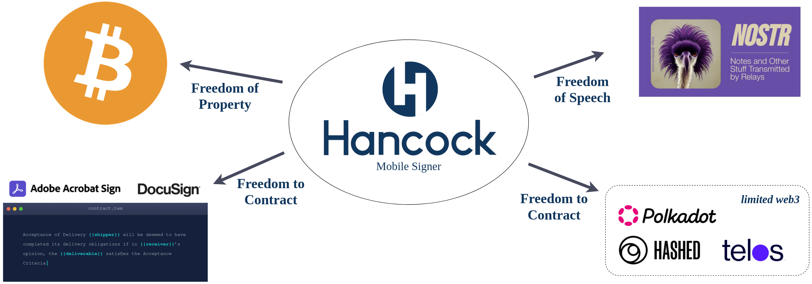

<head>
  <title>🔌 Using Nostr Connect for Safe Signatures</title>
  <meta charSet="utf-8" />
  <meta property="og:title" content="🔌 Using Nostr Connect for Safe Signatures" />
  <meta property="og:image" content="https://coinstr.app/coinstr.png" />
  <meta property="og:description" content="This article describes the 5 methods for signing Nostr events and Bitcoin transactions. Coinstr uses Nostr Connect (NIP-46) to safely and securely orchestrate signatures among users. To best understand the full context of NIP-46 and signature orchestration, let's review the common UX patterns for Nostr, Bitcoin, and crypto transactions." />
  <meta property="og:url" content="https://coinstr.app/articles/nostr-connect" />
  <meta name="twitter:title" content="🔌 Using Nostr Connect for Safe Signatures" />
  <meta name="twitter:creator" content="@MaxGravitt">
  <meta name="twitter:card" content="summary_large_image" />
  <meta name="twitter:image" content="https://coinstr.app/coinstr.png" />
  <meta name="twitter:description" content="This article describes the 5 methods for signing Nostr events and Bitcoin transactions. Coinstr uses Nostr Connect (NIP-46) to safely and securely orchestrate signatures among users. To best understand the full context of NIP-46 and signature orchestration, let's review the common UX patterns for Nostr, Bitcoin, and crypto transactions." />

</head>

Coinstr uses [Nostr Connect NIP-46](https://github.com/nostr-protocol/nips/blob/master/46.md) to safely and securely orchestrate signatures among users. To best understand the full context of NIP-46 and signature orchestration, let's review the common UX patterns for Nostr, Bitcoin, and crypto transactions. For simplicity, this analysis does not include multisignature, hardware, or cold wallets.

## 🖥️ Method #1: Desktop Application
In this scenario, a desktop application is either compiled from source or a binary is downloaded from the application's site, a package manager such as `apt`, or a propreitary service such as Apple's App store. Keys are input and stored with the primary application that the user is engaging with. 

Pros: 
- Desktop applications are generally considered more secure than browsers because they do not share memory space with other applications. 
- UX is generally the best, especially for more complex "expert systems" that have a lot of inputs or gadgets for the user to interact with.

Cons:
- Downloading and installing a desktop application is usually too high of a hurdle for most users.
- Many (more corporate) businesses do not allow users to install new desktop applications without going through an onerous IT department process.
- Storing the private key with the application that has knowledge about the power or wealth of that key creates a conflict of interest and honeypot.

Examples: 
- Sparrow and Electrum (Bitcoin)
- Gossip, Monstr, and nostr-console (Nostr)

## 🌐 Method #2: Desktop Browser - web 2 style
In most common web2 applications, users re-key or paste their password into a web form text box to authenticate. In web2, these passwords are typically hashed or encrypted and returned to the server where it is compared to the hash of the password that the application has on record for that user. In **some**, albeit few, web3 or nostr applications, users will paste their private key into a text box and the local, in-browser application (SPA/PWA) will use it to sign transactions. 

Pros:
- Easiest possible UX, lowest hurdles. I imagine many of the early nostr users, especially experimenters, started by navigating to one of the web applications, and generated an in-browser key.

Cons: 
- Although password managers are popular now, many users still use copy/paste, which puts the private key onto the system clipboard that any application has access to.
- Users must trust the browser security as well as any browser plugins that are installed because they may have access to text inputs and memory.
- Same conflict of interest described above.
- Phishing and MITM attacks are most commonly perpetrated by presenting a web app that **looks** like the real thing but is not, capturing the user's private key.

Examples: 
- Snort, Hamstr (although they also allow other methods)

    

## ⚙️ Method #3: Desktop Browser Plugins
This method of signing was made mainstream by Metamask and is likely how the vast majority of crypto (non-bitcoin) users are signing transactions. It is made by possible in Nostr by [NIP-07](https://github.com/nostr-protocol/nips/blob/master/07.md).

Pros: 
- Of all the ways things must be "installed", browser plugins are typically the easiest for main stream users. It can be done with 3-4 clicks.
- The memory space and data stored within a browser plugin is not accessible by other plugins, the web applications, or the clipboard.
- Although counterfeit plugins do exist, the chrome, safari, and firefox libraries often review them and allow users to provide reviews, so there is less phishing than direct web apps.

Cons:
- Users must install the browser plugin and paste the private key with every browser and computer they want to use.
- Since there is a dependency on third party plugin stores, there is a risk of censorship.
- Privacy concern because any site the user visits can (typically) detect which browser plugins the user has installed.
- Businesses with IT departments, especially old-school and institutional, still have browser plugins on lockdown, hindering adoption in that vertical.

Examples:
- Metamask for EVM-based chains (and typically one for each large crypto ecosystem)
- NOS2x-FOX for Nostr
- Alby for Lightning

## 📱 Method #4: Mobile Application
In this scenario, a mobile application for iOS or Android is installed from the App Store, and that app is used to store the key and interface with the primary app and services. I imagine that this is most common manner that events are signed and bitcoin transactions are sent. 

The application typically has a mnemonic generation and verification onboarding flow, potential key backup service, and then the user can sign transactions in that application without needed to authenticate ever again.

Pros: 
- Everybody knows how to install mobile apps and every prospective user has a device.
- Even users with the most conservative banks are able to install applications on their devices and use them for work-related activities. 
- Mobile devices are the safest place for hot wallets and any connected device.

Cons:
- Installing an app is still a hurdle for many users. They won't do it to experiment, but only if they know they are going to use the app ongoing.
- Conflict of interest issue identified above still exists.
- Censorship risks are very real, and worse than browser plugins.

Examples: 
- [Damus](https://damus.io) for Nostr on iOS
- [Amethyst](https://github.com/vitorpamplona/amethyst) for Nostr on Android
- BlueWallet, Breeze, and Phoenix for Bitcoin

## 🤳 Method #5: Remote Signer
Although perhaps not perfect, this signing method is the [bees knees](https://www.urbandictionary.com/define.php?term=bees+knees) and the climax of you've been waiting for. 

This method separates secret storage and signature generation from the primary application itself, which most commonly is a web app but may also be a desktop app or another mobile app. The user initially authenticates by scanning a QR code in the web app. Then, when the user performs an action in the web app that requires a signature, a push notification is sent to the device with the content of that signature request.

The user reviews the information on their device to ensure it matches the action they performed in browser, tap to approve, the signature is returned to the browser, where it is broadcast to a relay or blockchain.

Pros: 
- Mobile device is the safest place way to sign with and store hot keys, everybody has one and knows how to use it.
- Conflict of interest issue is resolved because the *dumb* signer often does not know the context (associated power or wealth) of what is being signed.
- Same mobile application can be used to sign across browsers, computers, applications, and even blockchains or signature types.
- Simplicity- because signing is a simple and atomic process, the application itself can be fewer lines of code with less complexity and fewer dependencies.

Cons:
- Still at risk of censorship resistance a.la App stores, but much less so because the user does not do any "posting" or "sending" from the application itself.

### Example: Fireblocks 
Fireblocks is a propreitary multi-custody workflow system used by manage custodians and exchanges. The primary application is a web-based (where the user is still authenticated in a web2 manner) but asset transfers are sent as approvals to their mobile application. Fireblocks is a private company [valued at $8 billion](https://www.fireblocks.com/blog/550m-series-e-zero-to-crypto/).

### Example: Anchor Authenticator
Anchor, built by [Greymass](https://www.greymass.com/anchor), is the primary authenticator in the Antelope/EOSIO ecosystem. The mobile authenticator application's overall polish, key generation, signature request, and approval process is second to none. The only tragedy is that it only works for Antelope-based blockchains.

### Example: Nostr Connect and Nostrum
Last week, NIP-46 was merged to the main branch of the NIPs repo. This NIP enables an open protocol for remote signatures on Nostr. This NIP is being implemented by key libraries and applications such as [rust-nostr](https://github.com/rust-nostr/nostr), [the Arc app](https://twitter.com/ArcadeCityMayor/status/1627150036852174853?s=20), and [Nostrum](https://github.com/nostr-connect/nostrum), now available as an APK or on Testflight.



 

# 🤩 Coming Soon: Hancock Signer 🤩

Under development by the same team building [Coinstr](https://coinstr.app) is Hancock, a mobile signature application.

Hancock signer uses NIP-46 and Nostr relays to handle signature orchestration for Nostr events, partially signed bitcoin transactions, limited shit coin transactions, and DocuSign-style ricardian contracts. 

Hancock provides core individual freedoms with a single mnemonic (private key) in a single application.
- Freedom of property (bitcoin)
- Freedom of speech (Nostr)
- Freedom to contract (web3 and legacy)

