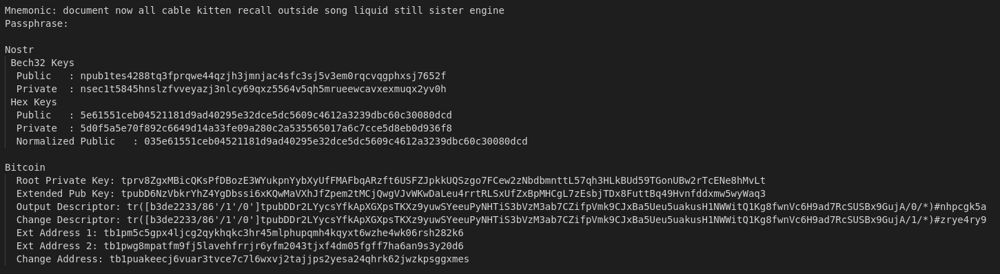

<head>
  <title>🚀 Coinstr Launches CLI for Bitcoin Multisig on Nostr</title>
  <meta charSet="utf-8" />
  <meta property="og:title" content="🚀 Coinstr Launches CLI for Bitcoin Multisig on Nostr" />
  <meta property="og:image" content="https://coinstr.io/coinstr.png" />
  <meta property="og:description" content="This Coinstr CLI tutorial provides a step by step command line demo of using Coinstr to create and spend with a 2-of-2 multisignature." />
  <meta property="og:url" content="https://coinstr.io/articles/coinstr-cli-launch" />
  <meta name="twitter:title" content="🚀 Coinstr Launches CLI for Bitcoin Multisig on Nostr" />
  <meta name="twitter:creator" content="@MaxGravitt">
  <meta name="twitter:card" content="summary_large_image" />
  <meta name="twitter:image" content="https://coinstr.io/coinstr.png" />
  <meta name="twitter:description" content="This Coinstr CLI tutorial provides a step by step command line demo of using Coinstr to create and spend with a 2-of-2 multisignature." />
</head>

The companion video walks through the steps of the tutorial.

<iframe width="560" height="315" src="https://www.youtube.com/embed/jW5_6kZWuWU" frameborder="0" allowfullscreen></iframe>

Here are the activities that we will cover in the tutorial:


@startuml
left to right direction
actor Frank as f
actor Gary as g

usecase "Create Policy" as UC1
usecase "Review Policy" as UC2
usecase "Fund Policy" as UC3
usecase "Create Spend Proposal" as UC4
usecase "Approve Spend Proposal" as UC5
usecase "Broadcast Transaction" as UC6

f --> UC1
f --> UC2
f --> UC3
f --> UC4
f --> UC5
g --> UC5
g --> UC6
@enduml

## Step by Step - 2 of 2 Multisig
This step by step guide shows how to create a 2 of 2 multisignature Bitcoin transaction using `coinstr-cli`. 

For this tutorial, you'll need to [install rust](https://rustup.rs) and also build Coinstr.

## Step 1. Build Coinstr
```
git clone https://github.com/NostrDevKit/coinstr.git && cd coinstr && cargo build --release
```

## Step 2. Setup Keys
Create keys and save them to keychains. I've used the keychain names of `frank` and `gary`.

`--password` is for encrypting your local keechain file, while `--passphrase` is applied to your mnemonic and alters the keys. Below, the password is set to `1234` and I am not using a passphrase.

*Generate Frank's Key*
```
./target/release/coinstr-cli generate --password 1234 --passphrase "" frank
```

*Generate Gary's Key*
```
./target/release/coinstr-cli generate --password 1234 --passphrase "" gary
```

### Inspect Keys

We can inspect the keys we just created by running: 
```bash
COINSTR_PASSWORD=1234 ./target/release/coinstr-cli --network testnet inspect frank
```

This will show the mnemonic as well as useful key-related derived information for both Nostr and Bitcoin.


## Step 2: Create the 2-of-2 Policy
Using miniscript, we will create a 2 of 2 multisignature policy that follows this format: 
```
thresh(2,pk(<FRANK_PUBKEY>),pk(<GARY_PUBKEY>))
```

Inspect the keys you created above and paste your Nostr HEX public key into the miniscript template.

So, the miniscript for our 2 of 2 policy is (your keys will be different):
```
thresh(2,pk(5e61551ceb04521181d9ad40295e32dce5dc5609c4612a3239dbc60c30080dcd),pk(d223b67e6091ef0665188a4016d20a51a7bbb1b240fafc4429bf1329527338d1))
```

## Step 3: Save the Policy 
Save the policy using the key, policy name, policy description, and the output descriptor.

**Usage**: coinstr-cli save-policy <NAME> <POLICY_NAME> <POLICY_DESCRIPTION> <POLICY_DESCRIPTOR>

```
COINSTR_PASSWORD=1234 ./target/release/coinstr-cli save-policy frank "Multisig 2 of 2" "Testing multisig as part of the Coinstr CLI tutorial" "thresh(2,pk(5e61551ceb04521181d9ad40295e32dce5dc5609c4612a3239dbc60c30080dcd),pk(d223b67e6091ef0665188a4016d20a51a7bbb1b240fafc4429bf1329527338d1))"
```

Now you can review the saved policies for frank using the following command: 
```
COINSTR_PASSWORD=1234 ./target/release/coinstr-cli get policies frank
```

Produces: 


You can see the details of the policy by calling `get policy`: 
```
COINSTR_PASSWORD=1234 ./target/release/coinstr-cli --network testnet get policy frank b4d4e03aaf64e58495f1eab7192a205b6607ec45f9aadbf7332734195f331fcc
```

Produces the following output: 


## Step 4: Get Testnet BTC from Faucet
Use the [testnet bitcoin faucet](https://testnet-faucet.com/btc-testnet/) to request BTC for our policy. The deposit address is at the bottom of the output above.

## Step 5: Generate a Spend Proposal
We will create the spend proposal from Alice's perspective. to create a spend proposal: 

**Usage**: coinstr-cli spend <NAME> <POLICY_ID> <TO_ADDRESS> <AMOUNT> <MEMO>

```
COINSTR_PASSWORD=1234 ./target/release/coinstr-cli --network testnet spend frank b4d4e03aaf64e58495f1eab7192a205b6607ec45f9aadbf7332734195f331fcc mohjSavDdQYHRYXcS3uS6ttaHP8amyvX78 1000 "Send back to the faucet"
```

You can now view the spend proposal:
```
COINSTR_PASSWORD=1234 ./target/release/coinstr-cli get proposals frank
```
Create the below table: 


## Step 6: Approve a Spend Proposal
Now we need to approve the proposal from both Frank and Gary's perspective.

*Approve from Frank:*
```
COINSTR_PASSWORD=1234 ./target/release/coinstr-cli approve frank 807d1c70d1e793616f62e8293180188c9ca6310777c52e538531336051240aee
```

*Approve from Gary:*
```
COINSTR_PASSWORD=1234 ./target/release/coinstr-cli approve gary 807d1c70d1e793616f62e8293180188c9ca6310777c52e538531336051240aee
```

## Step 7: Broadcast the Transaction
```
COINSTR_PASSWORD=1234 ./target/release/coinstr-cli --network testnet broadcast gary 807d1c70d1e793616f62e8293180188c9ca6310777c52e538531336051240aee
```

You will get a transaction-id that you can view with a [block explorer](https://blockstream.info/testnet/tx/85e1b65c4e824dc04bb4ca6bce2c1ddf9b0a2d6f0887d0ccaba2fa1d9924fae9): 
```
Transaction 85e1b65c4e824dc04bb4ca6bce2c1ddf9b0a2d6f0887d0ccaba2fa1d9924fae9 broadcasted

Explorer: https://blockstream.info/testnet/tx/85e1b65c4e824dc04bb4ca6bce2c1ddf9b0a2d6f0887d0ccaba2fa1d9924fae9
```
