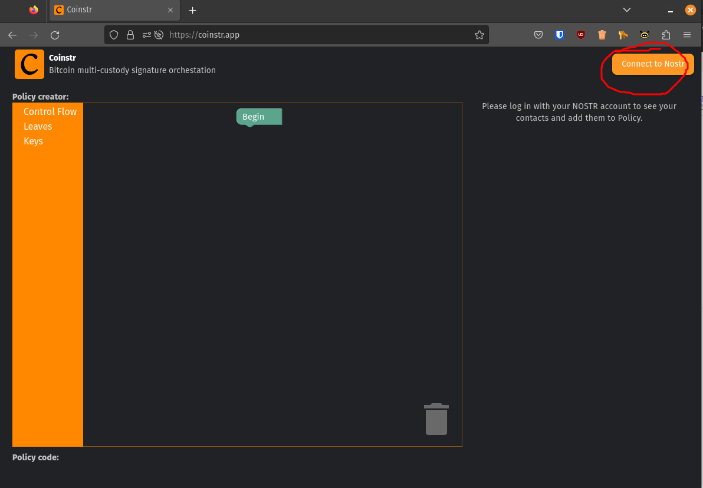
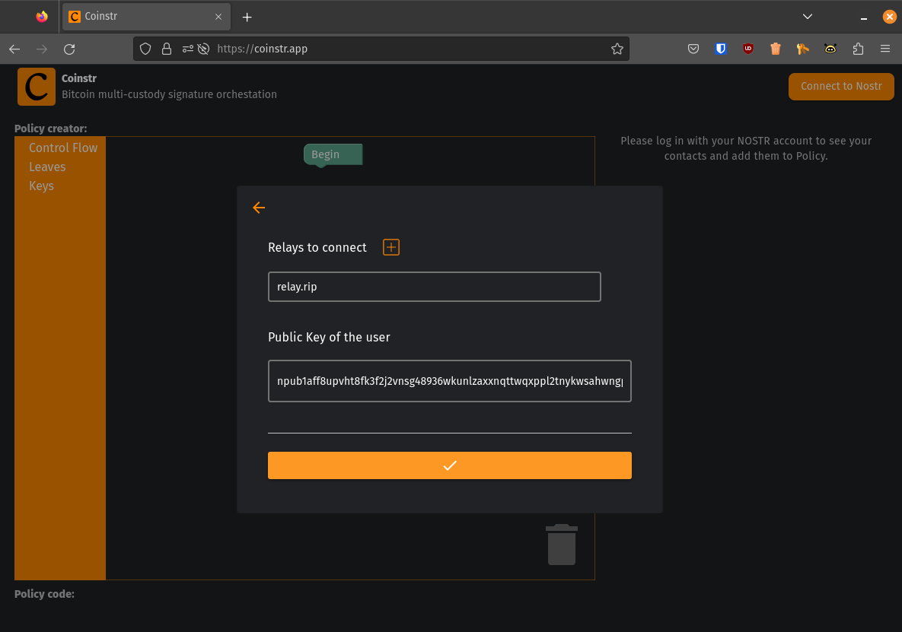
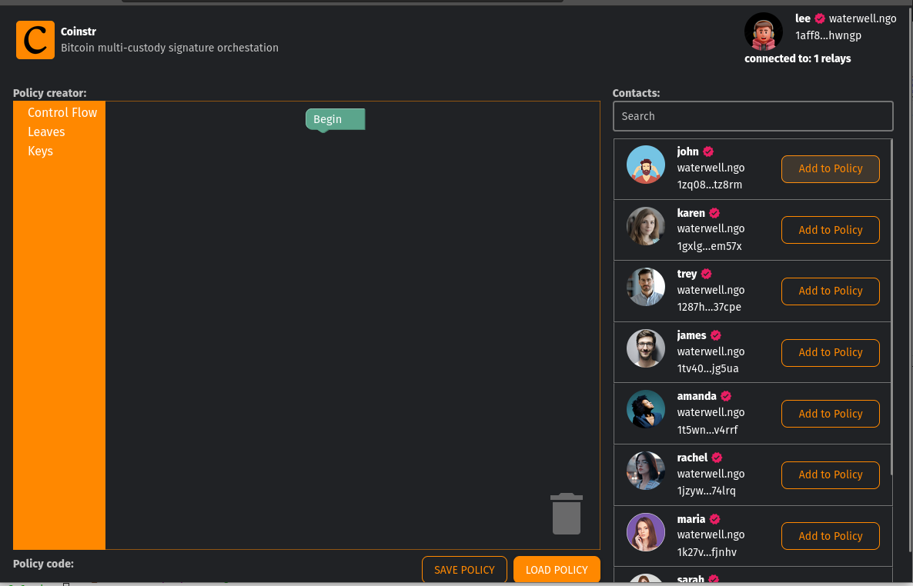
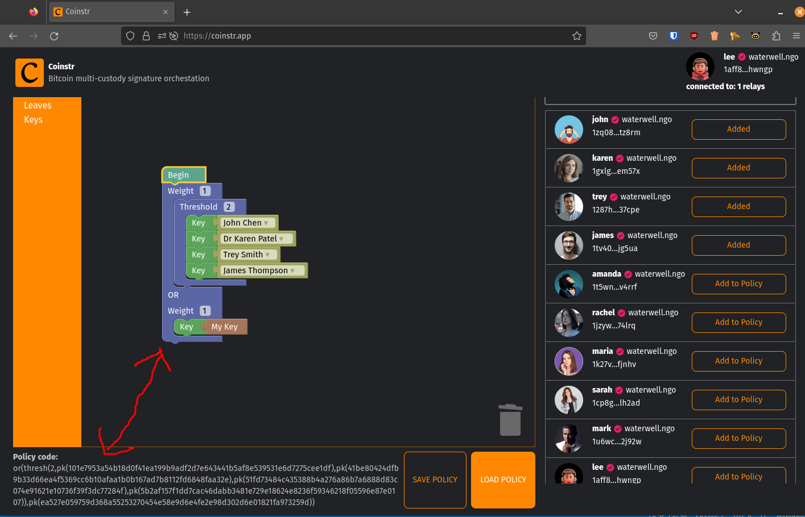

<head>
  <title>🫂 Build your Spending Policy from Nostr Contacts</title>
  <meta charSet="utf-8" />
  <meta property="og:title" content="🫂 Build your Spending Policy from your Nostr Contacts" />
  <meta property="og:image" content="https://coinstr.io/coinstr.png" />
  <meta property="og:description" content="Coinstr.app launches with the ability to build a policy from your Nostr contacts" />
  <meta property="og:url" content="https://coinstr.io/articles/coinstr-app-launch" />
  <meta name="twitter:title" content="🫂 Build your Spending Policy from your Nostr Contacts" />
  <meta name="twitter:creator" content="@MaxGravitt">
  <meta name="twitter:card" content="summary_large_image" />
  <meta name="twitter:image" content="https://coinstr.io/coinstr.png" />
  <meta name="twitter:description" content="Coinstr.app launches with the ability to build a policy from your Nostr contacts" />
</head>

The policy builder POC is deployed to [Coinstr.app](https://coinstr.app) for initial experimentation. 

Check it out by logging in with the the pre-filled pretend user.

# Step 1: Go to coinstr.app and click Connect to Nostr

# Step 2: Click Login with Key and use the pre-filled key

# Step 3: Add Some Users to the Policy

# Step 4: Add Some Control Flow & Keys

